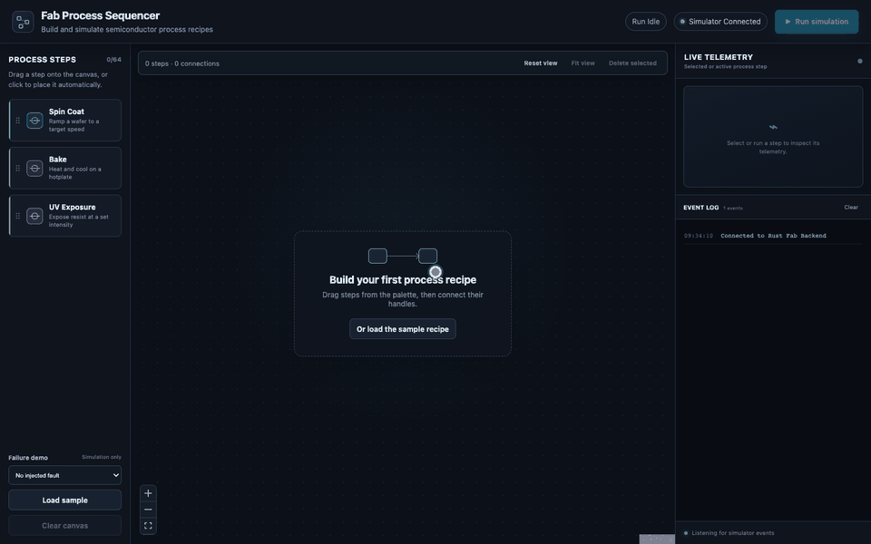
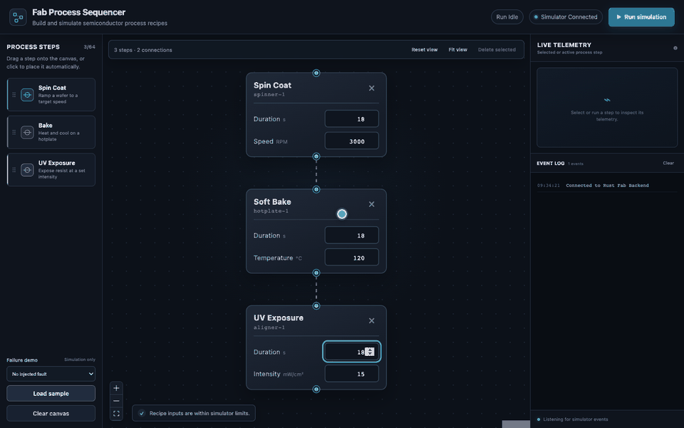
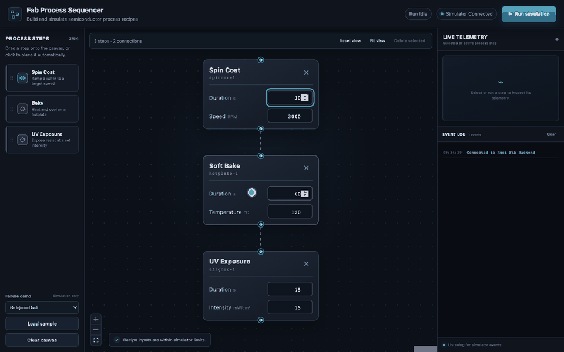

# Fab Process Sequencer

A software-defined semiconductor fabrication control system.

This project is a full stack (Rust + TypeScript), event driven platform featuring a visual node based sequencer and a high performance concurrent telemetry engine. It is designed to demonstrate how software can remove iteration bottlenecks in physical manufacturing environments.

**[Launch the live demo](https://fab-process-sequencer.onrender.com/)**

## The Problem & Solution

In semiconductor manufacturing, iteration speed is often limited by rigid hardware control software. When process engineers tweak photolithography recipes (e.g., bake times or spin speeds), they often face a "feedback loop bottleneck" where software changes are slow and disconnected from visual process design.

**The Solution:** This system decouples _process design_ from _hardware execution_. Engineers design workflows visually as graphs, which are compiled into execution logic and run by a concurrent Rust backend with real-time telemetry streaming back to the UI.

## Usage

1. Drag nodes (Spin Coat, Bake, Exposure) onto canvas
2. Configure parameters (RPM, temperature, duration, etc.)
3. Connect nodes to define process flow
4. Click **Run simulation**
5. Watch real-time execution and telemetry updates

## Tech Stack

- **Backend:** Rust, Axum, Tokio, Serde
- **Frontend:** React, TypeScript, React Flow, WebSockets
- **Communication:** Full duplex WebSockets
- **Architecture:** Event-driven system using `mpsc` channels

## In Action

### Build recipes visually

Add process steps, position them on the canvas, tune equipment parameters, and remove them without touching control code.



### Execute with live telemetry

Run a connected recipe while the UI tracks step lifecycle, simulated tool readings, and the complete event stream over WebSockets.



### Make failures inspectable

Inject an equipment interlock failure and see it propagate consistently through the active node, telemetry plot, run state, and event log.



## Core Features

- **Recipe Execution:** Connected recipes are validated and executed as typed process steps.
- **Bounded Async Backend:** Rust Tokio tasks stream simulation events without blocking the WebSocket server.
- **Real-Time Telemetry:** Streaming system reports execution status live via WebSockets.
- **Interactive UI:** Node based drag-and-drop process builder with parameter editing and live feedback.
- **Topological Sorting:** To detect any unwanted cycles in graph.

## Project Structure

```text
.
├── backend/
│   ├── src/
│   │   ├── executor.rs     # Typed process simulation
│   │   ├── models.rs       # Versioned wire protocol and validation
│   │   ├── server.rs       # Axum WebSocket transport
│   │   └── main.rs         # Application entry point
│   └── Cargo.toml
├── frontend/
│   ├── src/
│   │   ├── components/
│   │   ├── hooks/
│   │   ├── types/
│   │   ├── utils/
│   │   └── App.tsx
│   └── package.json
└── README.md
```

## Setup

### Backend (Rust)

```bash
cd backend
cargo run
```

Server runs at:

```
ws://127.0.0.1:3000/ws
```

### Frontend (React)

```bash
cd frontend
npm install
npm run dev
```

Open:

```
http://localhost:5173
```

Vite proxies `/ws` to the local Rust server. In production, the Rust service
serves the compiled frontend and WebSocket from the same origin.

## Vision

Next: replace the simulator with real SCPI command dispatch to a physical instrument over USB or GPIB.
