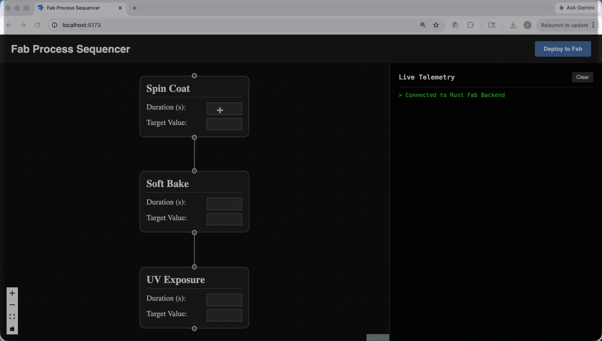
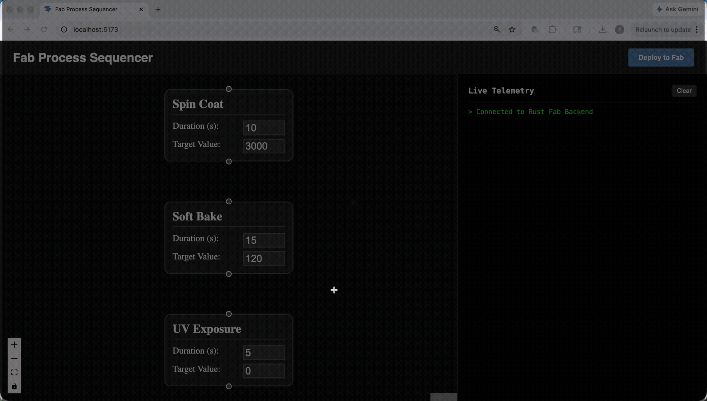

# Fab Process Sequencer

_A software-defined semiconductor fabrication control system._

This project is a full-stack, event-driven platform featuring a visual node-based sequencer and a high-performance concurrent telemetry engine. It is designed to demonstrate how software can remove iteration bottlenecks in physical manufacturing environments.

## The Problem & Solution

In semiconductor manufacturing, iteration speed is often limited by rigid hardware control software. When process engineers tweak photolithography recipes (e.g., bake times or spin speeds), they often face a "feedback loop bottleneck" where software changes are slow and disconnected from visual process design.

**The Solution:** This system decouples _process design_ from _hardware execution_. Engineers design workflows visually as graphs, which are compiled into execution logic and run by a concurrent Rust backend with real-time telemetry streaming back to the UI.

## Usage

1. Drag nodes (Spin Coat, Bake, Exposure) onto canvas
2. Configure parameters (RPM, temperature, duration, etc.)
3. Connect nodes to define process flow
4. Click **Deploy to Fab**
5. Watch real-time execution and telemetry updates

## Tech Stack

- **Frontend:** React, JavaScript, React Flow, WebSockets
- **Backend:** Rust, Axum, Tokio, Serde
- **Communication:** Full-duplex WebSockets
- **Architecture:** Event-driven system using `mpsc` channels

## In Action

**Live execution with real-time telemetry streaming:**


**Dynamic node reordering with automatic topological sorting:**


## Core Features

- **Graph-Based Execution:** Processes are compiled into a directed graph and executed via topological sorting.
- **High-Concurrency Backend:** Rust Tokio tasks simulate independent fab machines without blocking.
- **Real-Time Telemetry:** Streaming system reports execution status live via WebSockets.
- **Interactive UI:** Node-based drag-and-drop process builder with parameter editing and live feedback.

## Project Structure

```text
.
├── backend/
│   ├── src/
│   │   └── main.rs         # Axum server & concurrency logic
│   └── Cargo.toml
├── frontend/
│   ├── src/
│   │   ├── components/
│   │   ├── hooks/
│   │   ├── utils/
│   │   └── App.jsx
│   └── package.json
└── README.md
```

## Setup

### Backend (Rust)

```bash
cd backend
cargo run
```

Server runs at:

```
ws://127.0.0.1:3000/ws
```

### Frontend (React)

```bash
cd frontend
npm install
npm run dev
```

Open:

```
http://localhost:5173
```

## Vision

Next: replace the simulator with real SCPI command dispatch to a physical instrument over USB or GPIB.
